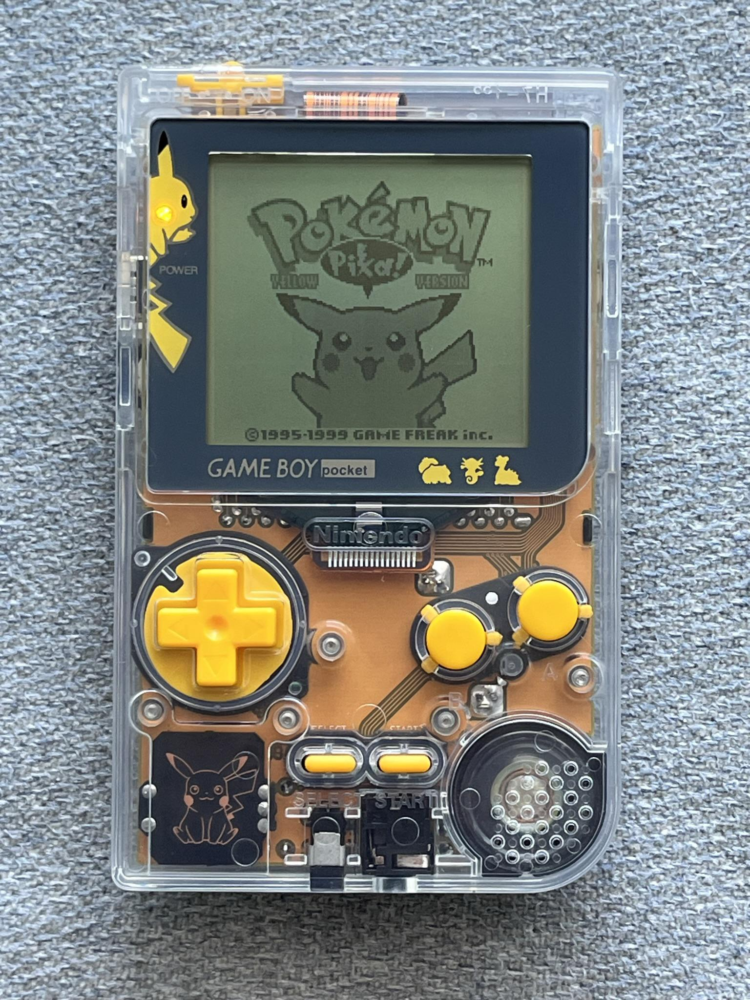
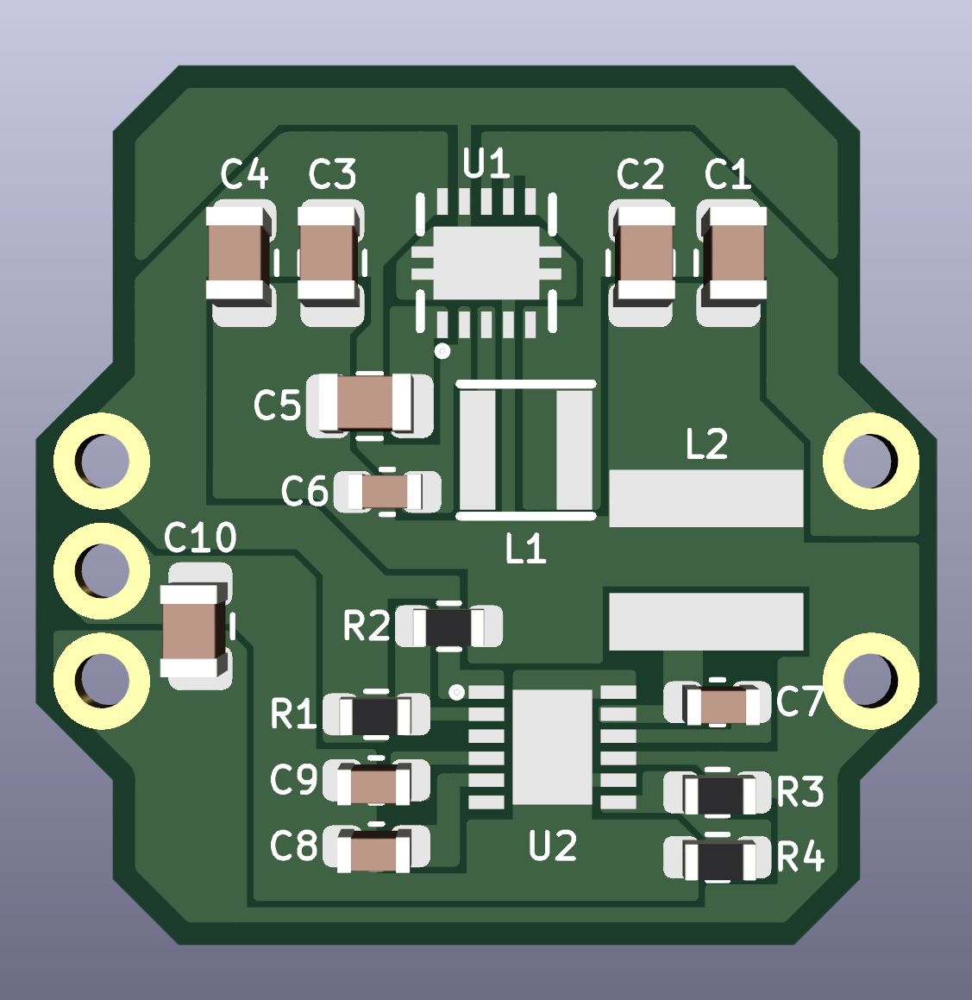

# SZ-MGB-REG

This power regulator takes the SZ-REG and adds a -18V rail to power an OEM Game Boy Pocket screen.  This regulator mimics the OEM Game Boy Pocket regulator; therefore, it can also control brightness on the FunnyPlaying GBP IPS LCD kits.

# Ordering

*Blank*

A version of this regulator without any silkscreen/image is available in this github as a gerber. Upload the gerber to a PCB fab (JLCPCB, PCBWay, OSHPark) with a board thickness of at least 1.6mm, HASL, and in your favorite color. 

# Bill of Materials

| Reference | Value | Package |
| :---: | :---: | :---: |
| C1 | 10uF | 0805 |
| C2 | 0.1uF | 0805 |
| C3 | 10uF | 0805 |
| C4 | 10uF | 0805 |
| C5 | 0.1uF | 0805 |
| C6 | 2.2uF | 0603 |
| C7 | 0.1uF | 0603 |
| C8 | 2.2uF | 0603 |
| C9 | 0.01uF | 0603 |
| C10 | 10uF | 0805 |
| R1 | 3.32M | 0603 |
| R2 | 1.33M | 0603 |
| R3 | 422K | 0603 |
| R4 | 22K | 0603 |
| L1 | 2.2uH | NR3015T2R2M |
| L2 | 75uH | ASPI-4020S-750M-T |
| U1 | 5V REG | TPS61202DSCR |
| U2 | -18V REG | MAX17579ATC+ |

A more detailed Bill of Materials with links to purchase components can be found in the Excel spreadsheet.

# Disclaimer

Assembly of this PCB requires micro-soldering experience; you will be required to solder QFN chips as well as SMD components.

I am not responsible for any damage to your Game Boy Pocket.  I am not an electrical engineer so please use this regulator at your own risk.

If you have suggestions to improve or identify issues with the PCB design, please contact me on discord: *skimzor#5078*.

# License

 
 
This project/PCB is licensed under a Creative Commons Attribution-NonCommercial-ShareAlike 4.0 International License. ***Under this license, you are not permitted to profit from or commercialize this project.***
